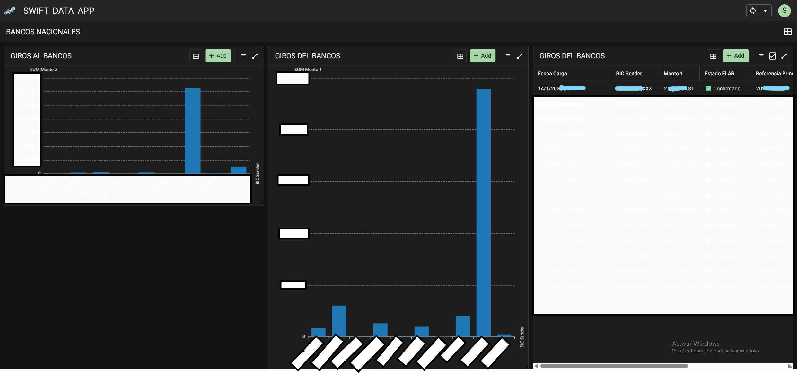

# ISO 20022 Enterprise Pipeline & Automation Suite 🏦

> Solución de automatización bancaria de alto rendimiento para el ciclo de vida SWIFT (MT/MX). Incluye descarga SFTP segura, parsing ISO 20022, reportes PDF y dashboard móvil vía AppSheet API.


## 📋 Resumen Ejecutivo
Este pipeline fue diseñado para modernizar la conciliación de mensajería financiera en entornos de banca central. Automatiza el flujo completo de datos: desde la recepción de archivos crudos (XML/TXT) en servidores seguros hasta la visualización de métricas en dispositivos móviles de la gerencia.

### Capacidades Técnicas
* **Seguridad Ofensiva:** Gestión de credenciales mediante encriptación `AES-256` (Fernet) y rotación obligatoria de llaves.
* **Parsing Híbrido:** Motor capaz de procesar mensajería legacy (MT940/950) y el nuevo estándar XML (pacs.008, camt.053).
* **Normalización Financiera:** Algoritmo inteligente para unificar formatos de moneda europeos y americanos.

---

## 📱 Mobile Integration (AppSheet API)
El sistema no se limita al procesamiento backend; inyecta datos procesados en tiempo real a una aplicación **No-Code (AppSheet)** para monitoreo operativo 24/7.

### 1. Notificaciones Push en Tiempo Real
Cada vez que se procesa una transferencia de alto valor o una instrucción prioritaria, el script dispara una alerta a los dispositivos autorizados.


### 2. Dashboard Operativo Web/Móvil
Visualización del estado de los giros, conciliación de BICs y volúmenes transaccionales dolarizados al instante.



---

## 🛠️ Arquitectura del Pipeline

```mermaid
graph TD
    A[SFTP Server] -->|Secure Download| B(Python ETL Engine)
    B -->|Decrypts| C{Credential Manager}
    B -->|Parses| D[ISO 20022 / MT Parser]
    D -->|Generates| E[PDF Reports]
    D -->|Syncs JSON| F[AppSheet API]
    F -->|Updates| G[Mobile Dashboard]
